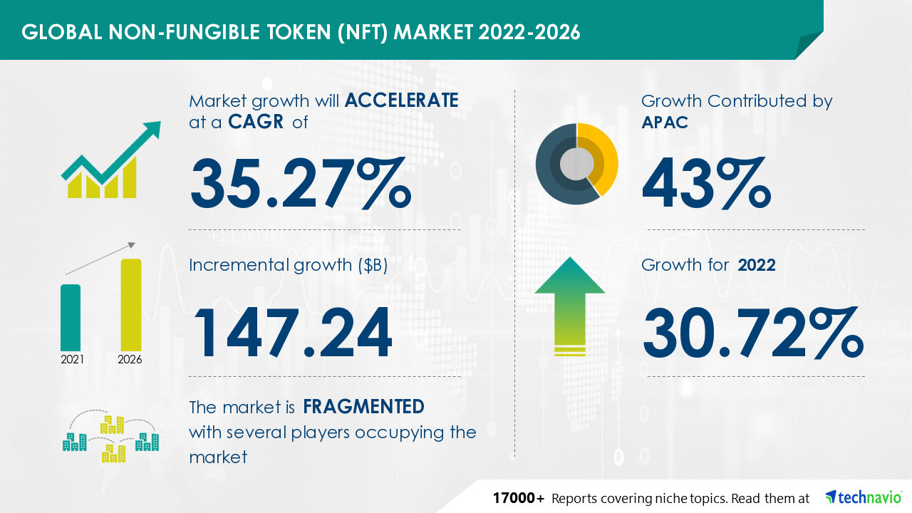

# About Cryptocurrency & NFT

A cryptocurrency, crypto-currency, or crypto is a digital currency that functions as a medium of exchange via a computer network and is not enforced or defended by any central authority, such as a government or bank.

NFT is an abbreviation for non-fungible token (NFT), which is generally created using the same type of programming as cryptocurrency. This cryptographic asset is founded on blockchain technology. They cannot be exchanged or traded in the same way that other cryptographic assets can.



According to a recent Mckinsey & Company study, Indonesia outpaced the rest of the world in digital adoption, with the highest digital adoption growth score of 99% from 2014 to 2017, outperforming India, South Korea, the United Kingdom, and the United States.

In 2019, Google and Temasek released eConomy SEA 2019, a report on Southeast Asia's internet economy. With an annual growth rate of more than 40%, Indonesia is one of the region's two leaders. It was worth $40 billion in 2019 and is expected to be worth $130 billion by 2025.

Indonesia has a largely cash-based society, with up to 80% of the population unbanked. However, technological adoption is becoming more visible by the day. The value of electronic money transactions increased 207% in 2019 to IDR 145.2 trillion. In Indonesia, nearly 9 out of 10 internet users use digital wallets.

In Indonesia, the Blockchain and Crypto Asset Industry has grown rapidly over the last five years. The number of traders in Indonesia is expected to reach a significant number, more than 1.5 million by 2020. Growing at least 2.263% since 2015, when 152 projects were traded in Indonesia.

The Ministry of Trade of the Republic of Indonesia legalized the trading of Bitcoin and crypto assets as commodities in Indonesia in September 2018. In 2019, BAPPEBTI issued regulations allowing cryptocurrency exchanges to operate legally in Indonesia. This is a positive sign that the Indonesian government supports the growth of the crypto industry in the country. Whereas at the end of 2020 (Q3), Indonesian crypto transactions totaled IDR 22.671 trillion.

<figure><figcaption></figcaption></figure>



This is analogous to comparing investors and traders. While all traders invest, not all investors trade. It should be noted that the majority of cryptocurrency users typically own coins and tokens.

When Bitcoin first appeared, it defined what it meant to be a coin. There are distinct characteristics that distinguish crypto coins from tokens, which are similar to traditional currency.

The following characteristics distinguish coins:

1\. Runs on its own blockchain.

The blockchain records all transactions involving real crypto coins.

When you pay someone with Ethereum, the transaction is recorded on the Ethereum blockchain. If the same person later pays you back in Bitcoin, the receipt is added to the Bitcoin blockchain. Every transaction is encrypted and can be accessed by any member of the network.

2\. Act as money.

Bitcoin was created solely to replace traditional currency. Other coins, such as ETH, NEO, and Litecoin, were inspired by the paradoxical appeal of transparency and anonymity.

Many of today's major corporations, including Amazon, Microsoft, and Tesla, accept crypto coins as payment for goods and services. El Salvador recently adopted Bitcoin as an official currency alongside the US dollar.

3\. It is mineable.

&#x20;

There are two ways to earn crypto coins. Traditional mining with a Proof of Work system is one of them. This method is used by Bitcoin hunters to increase their earnings. The issue is that there aren't many Bitcoins left to mine, so the process becomes more difficult by the day.

Proof of Stake is another method for earning coins that is more modern. It uses less energy and is simpler to implement. Cardano is one of the most popular coins to use this system.

Tokens, unlike coins, do not have a blockchain. They instead operate on other cryptocurrency blockchains, such as Ethereum. BAT, BNT, Tether, and various stablecoins such as USDC are some of the most commonly seen tokens on Ethereum.

While the blockchain handles crypto coin transactions, tokens rely on smart contracts. They are a set of codes that allow users to trade or pay each other. Each blockchain has its own set of smart contracts. Ethereum, for example, employs ERC-20, while NEO employs Nep-5.

Tokens physically move from one location to another when they are spent. Trading NFTs is a good example (or non-fungible tokens). Because it was a one-of-a-kind item, ownership changes had to be handled manually. Because NFTs frequently have only sentimental or artistic value, they are similar to utility tokens, except that no services are required.

It differs from coins in that the account balance is the only thing that changes. When you transfer money from one bank to another, it does not leave your account. The bank adds to both accounts' balances and keeps the charge. The blockchain works in the same way: the balance in your wallet changes, and transactions record it.

Another distinction between tokens and coins is what they represent. Tokens can represent assets or deeds, whereas crypto coins are essentially digital versions of money.

Tokens can be purchased with coins, but some tokens have greater value than others. As an example, consider company stock. However, because there are usually restrictions on where a token can be spent, it lacks the liquidity that coins provide.



NFT is an abbreviation for non-fungible token (NFT), which is generally created using the same type of programming as cryptocurrency. This cryptographic asset is founded on blockchain technology. They cannot be exchanged or traded in the same way that other cryptographic assets can.

Such as Bitcoin or Ethereum. Because of its unique properties, the term NFT clearly states that it cannot be replaced or exchanged. Cryptocurrencies and physical currency are interchangeable, which means they can be traded or exchanged for one another.

The ERC-721 standard gave rise to NFT. ERC-721, created by the same team that created the ERC-20 smart contract, defines the minimum interface—ownership, security, and metadata details—required for the exchange and distribution of game tokens. The ERC-1155 standard expands on the concept by lowering transaction and storage fees for NFTs and combining several types of non-fungible tokens into a single contract.

NFTs can also help to democratize investing by dividing up physical assets like real estate. Digital real estate assets are much easier to divide among multiple owners than physical assets. This tokenization ethic does not have to be limited to real estate; it can apply to other assets as well, such as works of art. As a result, a painting does not always have to have a single owner. Each owner of the digital equivalent is responsible for a small portion of the painting. This type of arrangement can boost its value and revenue.

<figure><figcaption></figcaption></figure>


