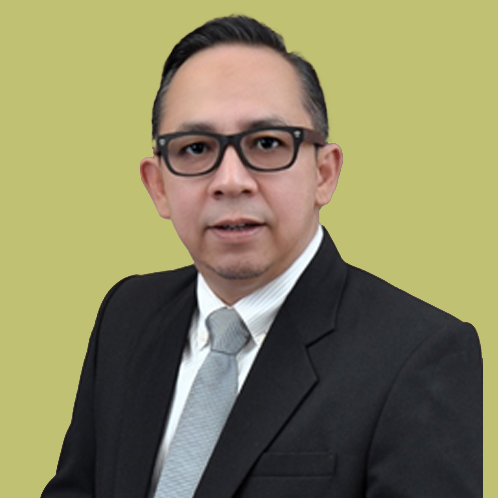

# About Us – NFT-Proland

<table data-view="cards"><thead><tr><th>Name</th><th>Position</th></tr></thead><tbody><tr><td>Irwan Darmawan, Ir. CIB®</td><td>Vice-President of Regional Indonesia – Indonesia Based</td></tr></tbody></table>

<figure><figcaption>
He has experienced in Investment Banking, Corporate Finance, Underwriter, Audit Committee in the Capital Markets and Specific Industries in Indonesia more than 20 years. During his task, he also have a specialty in Oil&#x26; Gas Industry, Petrochemical, Gold mining, IT and Telecommunications, and Consumer products and advisors SME for the NGO. He also had an experienced for Reg.S/144A when he did for the first inaugural Global Bonds amounted USD 1.5 Billion for Indonesia National Oil Company as well as Indonesia Capital Market Protocol. His conducted and coordinated with regional and global Investment Bank Firm, Private Equity Funds and Supporting Professional due to fulfilled on his task. He also had experienced as CFO and Director for several Listed Company in Indonesia especially for restructuring and value creation for the company. Graduated from Bachelor of Industrial and Management Industrial Engineering, Institute Teknologi Nasional, Bandung and he had Investment Manager Competency in Indonesia Capital Market, Registered Indonesia Certified Investment Banking (CIB®) Competency, Underwriter Representative, Indonesia Audit Committee Member (IKAI), and other organization prophecy in Indonesia Capital Market.
</figcaption></figure>

