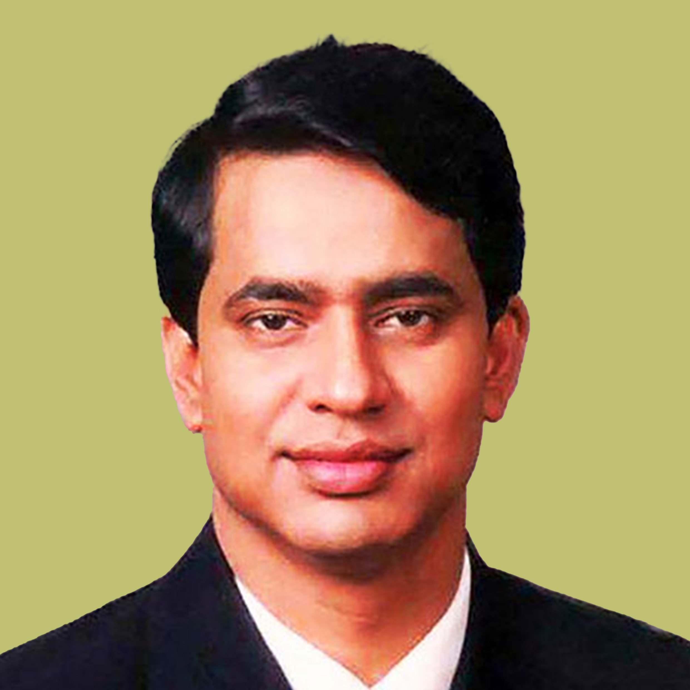

# Founder of the Ecosystem – Xhyre

<table data-view="cards"><thead><tr><th>Name</th><th>Position</th></tr></thead><tbody><tr><td>Md Abul Mansur</td><td>Managing Director – UK based</td></tr><tr><td>Bradley Prentice</td><td>Chief Executive Officer – UK Based</td></tr><tr><td>Ferdous Ahmed</td><td>SVP - Strategic Partnership – UK Based</td></tr></tbody></table>

<figure><figcaption>
A man who is relentlessly trying to push the boundaries of Deeptech. These sorts of shallow perspectives are hindering the resources and funding required for implementing Artificial Intelligence as an essential part of our lives" adds Abul Mansur. He is still hell bound to tap into the true potential of Artificial Intelligence. Seems like the R&#x26;D on artificial intelligence has only scratched the surface. Abul Mansur's primary focus is on DeepTech which signifies Artificial Intelligence to a great deal. After helping out the marginalized, he seeks to integrate artificial intelligence in day to day transactions, like the transference of Assets. The biggest future project that he is already invested in might be one of the biggest changes the world will ever see and it revolves around the State-Led Digital Currency, powered by Nuspay.
</figcaption></figure>

 

<figure><figcaption>
Bradley Prentice joins XHYRE as CEO in 2021 bringing the end of 20 years experience in senior roles related to service banking, payments industry and startups. Prior to joining XHYRE, Bradley led a Business development role at NCR in Sydney, Australia, a global payments technology company, where he successfully led the corporate hospitality sector for the ANZ/SP region. Previously, he also served as founding member and Senior Vice President, Corporate Development for the successful Singaporean startup Fast. He previously spent 19 years with American Express and held senior roles with Irdeto and Ingenico in Asia Pacific. Bradley is a seasoned executive with a track record of developing and leading high-performance teams in the payments-related space, while supporting these businesses through transition and growth stages.
</figcaption></figure>

 

<figure><figcaption>
Ferdous Ahmed is a seasoned professional with over 10 years of experience in startups in the telecommunications, healthcare and e-commerce space. In his previous roles, he served in a variety of roles from customer experience to strategic partnerships, and was known for driving brand growth, maximizing operational excellence and building strategic partnerships. Ferdous holds an MBA from the Rotman School of Management, University of Toronto and a Bachelor of Arts in Economics from the University of Texas at Austin.
</figcaption></figure>

